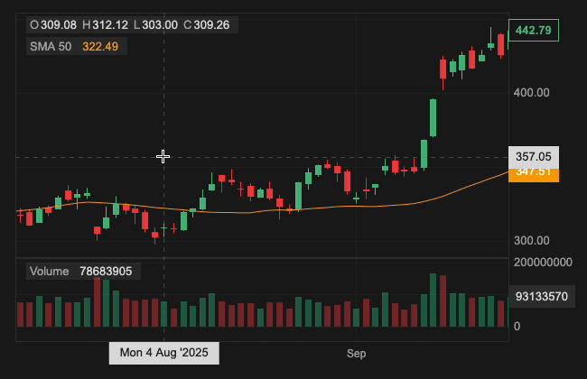
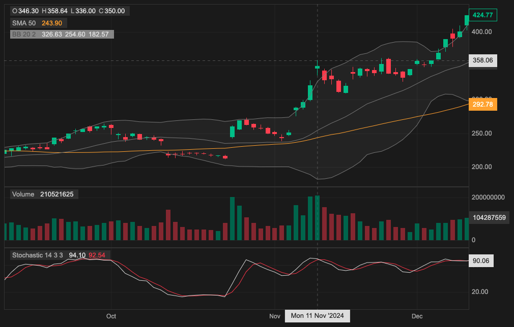

# React Candlesticks

[](https://www.npmjs.com/package/react-candlesticks)
[](./LICENSE)
[](https://bundlephobia.com/package/react-candlesticks)
[](https://www.npmjs.com/package/react-candlesticks)
[](https://react.dev/)
[](https://docs.reactcandlesticks.com/)
<!-- [](https://github.com/trendingcandles/react-candlesticks/actions/workflows/ci.yml) -->


Canvas-powered, composable candlestick charts for React — built for serious trading UIs.

Build responsive trading charts in React with candlesticks, indicators, crosshairs, zoom, and theming — rendered on Canvas for smooth performance on large datasets.

`react-candlesticks` is in an early public release / soft launch phase. Feedback, bug reports, and edge-case reproductions are especially helpful right now.

<!-- [](https://stackblitz.com/edit/react-candlesticks?file=src%2FApp.tsx) -->
[](https://stackblitz.com/edit/react-candlesticks?file=src%2FApp.tsx)

[](https://stackblitz.com/edit/react-candlesticks?file=src%2FApp.tsx)

[Website](https://reactcandlesticks.com/) • [Documentation](https://docs.reactcandlesticks.com/)

For bugs and feature requests, [open an issue](https://github.com/trendingcandles/react-candlesticks/issues). For usage questions, [start a discussion](https://github.com/trendingcandles/react-candlesticks/discussions/new?category=q-a).

---

## Installation

```bash
npm install react-candlesticks
```

## Quick Start

Paste this into your React app for a basic candlestick chart with volume:

```tsx
import 'react-candlesticks/style.css';
import { Chart, Panel, Candlesticks, VolumeBars, exampleData }
  from 'react-candlesticks';

export default function App() {
  return (
    <Chart
      width={800}
      height={500}
      granularity="d1"
      data={exampleData} // demo data
    >
      <Panel heightRatio={3}>
        <Candlesticks />
      </Panel>
      <Panel>
        <VolumeBars />
      </Panel>
    </Chart>
  );
}
```

`granularity` is optional if your dataset uses a consistent interval and you want the library to infer it automatically. For empty/loading states, pass `granularity` explicitly.

## Why React Candlesticks?

- **Canvas rendering** — smooth zoom, pan, and hover with predictable performance on large datasets
- **Composable like React** — build charts using JSX (React components)
- **Trading-focused** — indicators, crosshairs, multi-panel layouts
- **Precise interactions** — zoom, scroll, and hover tuned for financial UX
- **Fully themeable** — light and dark mode, or provide a custom theme
- **Lightweight & dependency-free** — no bloat, easy to ship

---

## Usage Patterns

### Declarative (JSX) ✅ recommended

The recommended approach for most use cases. Compose panels and layers declaratively using JSX.
```tsx
import { Chart, Panel, Candlesticks, VolumeBars, BollingerBands, EMA, MACD, RSI }
  from 'react-candlesticks';

<Chart granularity="d1" data={data}>
  <Panel heightRatio={3}>
    <Candlesticks />
    <EMA period={50} />
    <BollingerBands />
  </Panel>
  <Panel>
    <VolumeBars />
  </Panel>
  <Panel>
    <MACD />
  </Panel>
  <Panel>
    <RSI />
  </Panel>
</Chart>
```

### Config-driven (panels prop)

```tsx
import { Chart } from 'react-candlesticks';

<Chart
  granularity="d1"
  data={data}
  panels={[
    {
      heightRatio: 3,
      layers: [
        { type: 'price:candlesticks' },
        { type: 'ema', period: 20 },
        { type: 'bollinger-bands' },
      ]
    },
    {
      layers: [{ type: 'volume:bars' }]
    },
    {
      layers: [{ type: 'macd' }]
    },
    {
      layers: [{ type: 'rsi' }]
    }
  ]}
/>
```

### Theming

Use the built-in `'light'` or `'dark'` theme, or provide a custom `Theme` object.
```tsx
import type { Theme } from 'react-candlesticks';

// Named theme
<Chart theme="dark" ... />

// Custom theme
<Chart theme={myCustomTheme} ... />
```

See the [Theme documentation](https://docs.reactcandlesticks.com/docs/api/theme/theme) for the full theme shape.

---

## Compatibility and Limitations

- Supports React 18+ and React 19.
- Ships ESM only; CommonJS/UMD consumers are not supported.
- Intended for modern browser-based React apps.
- Chart rendering and interaction are client-side. In SSR frameworks, render the chart from a client component or client-only boundary.
- Runtime behavior depends on standard browser APIs including Canvas, `ResizeObserver`, `matchMedia`, `devicePixelRatio`, and Pointer Events for touch and pinch interactions.
- If you target older browsers or restricted webviews, you may need compatibility checks or polyfills for APIs such as `ResizeObserver`.
- Current chart time display defaults to `UTC`. A public chart-level timezone configuration API is not exposed yet, so if your UI requires exchange-local or user-local time labels, treat that as a current limitation.
- Mouse, trackpad, touch, and pinch interactions are covered in modern evergreen browsers. If you rely on embedded webviews, older Safari/WebKit builds, or custom kiosk environments, verify pointer and wheel behavior in your exact target runtime before rollout.
- Data should use a consistent interval if you want automatic `granularity` inference. For irregular datasets, pass `granularity` explicitly.

---

## Layers

| Layer | Type string | Description |
|---|---|---|
| `<Candlesticks>` | `'price:candlesticks'` | OHLC candlestick chart |
| `<PriceLine>` | `'price:line'` | Line chart of a single price field |
| `<VolumeBars>` | `'volume:bars'` | Volume bar chart |
| `<ATR>` | `'atr'` | Average True Range |
| `<BollingerBands>` | `'bollinger-bands'` | Bollinger Bands overlay |
| `<EMA>` | `'ema'` | Exponential Moving Average |
| `<MACD>` | `'macd'` | MACD oscillator |
| `<RSI>` | `'rsi'` | Relative Strength Index |
| `<SMA>` | `'sma'` | Simple Moving Average |
| `<Stochastic>` | `'stochastic'` | Stochastic Oscillator |

---

## API Reference

- [`API Reference Home`](https://docs.reactcandlesticks.com/docs/api/)
- [`ChartProps`](https://docs.reactcandlesticks.com/docs/api/chart/chart#properties)
- [`PanelConfig`](https://docs.reactcandlesticks.com/docs/api/panel/panel-config)
- [`LayerConfig`](https://docs.reactcandlesticks.com/docs/api/layer/layer-config)
- [`Theme`](https://docs.reactcandlesticks.com/docs/api/theme/theme)
- [`DataPoint`](https://docs.reactcandlesticks.com/docs/api/chart/data-point)
- [`Granularity`](https://docs.reactcandlesticks.com/docs/api/chart/granularity)

---

## Project Notes

- [`CHANGELOG.md`](./CHANGELOG.md)
- [`SECURITY.md`](./SECURITY.md)
- [`CONTRIBUTING.md`](./CONTRIBUTING.md)

---

## Prop Types

If you want runtime prop validation in a JavaScript app, install the optional peer dependency too:

```bash
npm install react-candlesticks prop-types
```

Then import `Chart` from the opt-in `propTypes` entrypoint:

```js
import { Chart } from 'react-candlesticks/propTypes';
```

---

## License

[MIT](./LICENSE)
